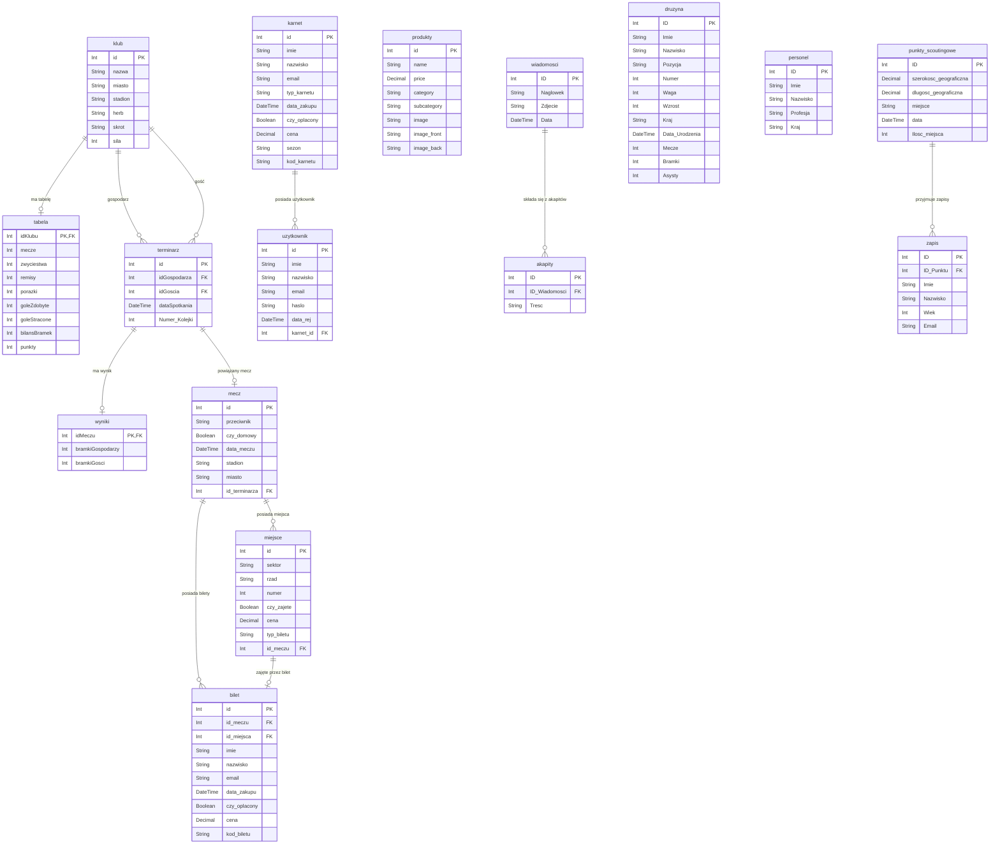

# 📘 Dokumentacja Projektu – Chaber Pobiedziska - aplikacja webowa

---

## Spis treści

1. [Opis aplikacji](#1-opis-aplikacji)
2. [Struktura projektu](#2-struktura-projektu)
3. [Podział pracy](#3-podział-pracy)
4. [Baza danych](#4-baza-danych)
5. [Uruchamianie projektu](#5-uruchamianie-projektu)
6. [Testowanie](#6-testowanie)

---

## 1. Opis aplikacji

**Chaber Pobiedziska - aplikacja webowa** to webowa aplikacja klubu piłkarskiego, zbudowana w architekturze **SPA (Single Page Application)**. Umożliwia kibicom i użytkownikom przeglądanie informacji o klubie, zakup biletów i karnetów, przeglądanie sklepu klubowego, śledzenie aktualności oraz zapisywanie się do akademii piłkarskiej.

### Technologie

| Warstwa | Technologia |
|---|---|
| Frontend | React (Vite + TypeScript) |
| Backend | Node.js + Express + TypeScript |
| ORM | Prisma |
| Baza danych | MariaDB 10.4.32 (lokalna baza `chaber`) |
| Stylowanie | SCSS Modules |
| Serwer produkcyjny | Nginx |
| Konteneryzacja | Docker / Docker Compose |
| Testy | Jest |

### Funkcjonalności

| Funkcjonalność | Ścieżka | Opis |
|---|---|---|
| Strona główna | `/` | Widok powitalny z banerem i skrótem informacji |
| Aktualności | `/aktualnosci` | Lista i szczegóły newsów klubowych |
| Terminarz / Tabela | `/terminarz` | Wyniki, terminarz i tabela ligowa |
| Drużyna | `/druzyna` | Zawodnicy i personel, szczegóły graczy |
| Sklep | `/sklep` | Przeglądanie i zakup produktów klubowych |
| Bilety | `/bilety` | Zakup biletów na mecze z wyborem miejsca |
| Karnet | `/bilety/karnet` | Zakup karnetu sezonowego |
| Akademia | `/akademia` | Informacje o akademii + formularz zapisu |
| Kontakt | `/kontakt` | Formularz kontaktowy |
| Profil użytkownika | `/profil` | Podgląd danych zalogowanego użytkownika |

> Większość podstron jest dostępna tylko dla zalogowanych użytkowników (chronione przez `ProtectedRoute`).

---

## 2. Struktura projektu

```
projekt_webowki/
├── docker-compose.yml          # Konfiguracja środowiska development
├── docker-compose.prod.yml     # Konfiguracja środowiska produkcyjnego
├── .env                        # Zmienne środowiskowe
├── .env.example                # Przykładowe zmienne środowiskowe
│
├── backend/
│   ├── src/
│   │   ├── index.ts            # Główny plik serwera Express
│   │   ├── prismaDb.ts         # Inicjalizacja klienta Prisma
│   │   ├── emailService.ts     # Serwis do wysyłania e-maili
│   │   ├── routes/             # Routery API
│   │   │   ├── authRouter.ts
│   │   │   ├── ticketsRouter.ts
│   │   │   ├── orderRouter.ts
│   │   │   ├── shopDbRouter.ts
│   │   │   ├── newsDbRouter.ts
│   │   │   ├── matchesDbRouter.ts
│   │   │   ├── tableDbRouter.ts
│   │   │   ├── playersDbRouter.ts
│   │   │   ├── staffDbRouter.ts
│   │   │   ├── scoutDbRouter.ts
│   │   │   ├── academyRegisterDbRouter.ts
│   │   │   └── contactRouter.ts
│   │   ├── tests/              # Testy jednostkowe backendu (Jest)
│   │   └── types/              # Typy TypeScript
│   ├── prisma/
│   │   ├── schema.prisma       # Schemat bazy danych
│   │   ├── dane.sql            # Dane inicjalne
│   │   └── migrations/         # Historia migracji
│   ├── Dockerfile              # Obraz dev
│   └── Dockerfile.prod         # Obraz produkcyjny
│
└── frontend/
    ├── src/
    │   ├── App.tsx             # Główny komponent z routingiem
    │   ├── auth/               # Kontekst i ochrona tras (AuthContext, ProtectedRoute)
    │   ├── components/         # Komponenty wielokrotnego użytku
    │   ├── routes/             # Widoki stron (strony)
    │   └── queries/            # Zapytania do API
    ├── nginx/
    │   └── nginx.conf          # Konfiguracja Nginx (produkcja)
    ├── Dockerfile              # Obraz dev
    └── Dockerfile.prod         # Obraz produkcyjny
```

### Routery backendu

| Router | Ścieżka API | Odpowiedzialność |
|---|---|---|
| `authRouter` | `/api/auth` | Rejestracja i logowanie użytkowników |
| `ticketsRouter` | `/api/tickets` | Zarządzanie biletami i karnetami |
| `orderRouter` | `/api/orders` | Obsługa zamówień ze sklepu |
| `shopDbRouter` | `/api/shop` | Produkty sklepowe |
| `newsDbRouter` | `/api/news` | Aktualności i newsy |
| `matchesDbRouter` | `/api/matches` | Mecze i terminarz |
| `tableDbRouter` | `/api/table` | Tabela ligowa |
| `playersDbRouter` | `/api/players` | Zawodnicy drużyny |
| `staffDbRouter` | `/api/staff` | Personel klubu |
| `scoutDbRouter` | `/api/scout` | Punkty scoutingowe |
| `academyRegisterDbRouter` | `/api/academyRegister` | Zapisy do akademii |
| `contactRouter` | `/api/contact` | Formularz kontaktowy (e-mail) |

---

## 3. Podział pracy

Projekt był realizowany przez trzyosobowy zespół. Każdy członek odpowiadał za wydzielony obszar funkcjonalny — zarówno po stronie frontendu, jak i backendu oraz testów.

---

### 🔧 Miłosz Hasik

Miłosz odpowiadał za fundamenty infrastrukturalne projektu oraz kluczową logikę związaną z użytkownikami i biletami.

| Obszar | Szczegóły |
|---|---|
| **Docker** | Stworzenie i konfiguracja całego środowiska Docker (`docker-compose.yml`, `docker-compose.prod.yml`, wszystkie `Dockerfile`) |
| **Nginx** | Konfiguracja serwera Nginx dla środowiska produkcyjnego (`nginx.conf`) |
| **Autentykacja** | Logowanie i rejestracja użytkowników (`authRouter`, `AuthContext`, `Login`) |
| **Bilety i karnety** | Pełna logika zakupu biletów na mecze oraz karnetów sezonowych (`ticketsRouter`, `Tickets`, `Ticket`, `SeasonTicket`) |
| **Strona kontaktowa** | Formularz kontaktowy z obsługą wysyłki e-mail (`contactRouter`, `emailService`, `ContactPage`) |
| **Style** | Pliki SCSS dla komponentów:`TicketPage`, `ContactPage`, `Login`, `ContactPage`, `Tickets`, `Ticket`, `SeasonTicket`, `StadiumMap` |
| **Testy** | Testy jednostkowe: `ContactPage.test.tsx`, `Login.test.tsx`, `protectedRoute.test.tsx`, `SeasonTicket.test.tsx`, `StadiumMap.test.tsx`, `Ticket.test.tsx`, `TicketPage.test.tsx`, `Tickets.test.tsx`, `auth.test.ts`, `contact.test.ts`, `tickets.test.ts` |

---

### ⚽ Paweł Zysnarski

Paweł zajmował się częścią informacyjną aplikacji — widokami prezentującymi dane klubowe i ligowe.

| Obszar | Szczegóły |
|---|---|
| **Strona główna** | Widok powitalny z banerem i skróconymi informacjami (`MainPage`) |
| **Aktualności** | Strona newsów oraz miniaturki artykułów (`NewsPage`, `News`, `NewsMini`) |
| **Tabela ligowa** | Pełna i mini tabela rozgrywek (`TablePage`, `Table`, `TableMini`) |
| **Drużyna** | Strony zawodników i personelu (`TeamPage`, `PlayerData`, `PlayerDesc`, `StaffData`, `StaffDesc`) |
| **Akademia** | Strona akademii z opisem oferty (`AcademyPage`) |
| **Style** | Pliki SCSS dla: `MainPage`, `NewsPage`, `News`, `TablePage`, `Table`, `TeamPage`, `PlayerData`, `PlayerDesc`, `StaffData`, `StaffDesc`, `AcademyPage` |
| **Testy** | Testy jednostkowe: `Academy.test.tsx`, `AcademyRegister.test.tsx`, `MainPage.test.tsx`, `Menu.test.tsx`, `News.test.tsx`, `PlayerData.test.tsx`, `PlayerDesc.test.tsx`, `Table.test.tsx`, `academyRegister.test.ts`, `news.test.ts`, `matches.test.ts`, `players.test.ts`, `staff.test.ts`, `scout.test.ts`, `table.test.ts`, `results.test.ts` |

---

### 🛒 Piotr Tomaszewski

Piotr był odpowiedzialny za pełną obsługę sklepu internetowego — od przeglądania produktów po finalizację zamówienia.

| Obszar | Szczegóły |
|---|---|
| **Sklep** | Przeglądanie produktów, filtrowanie i koszyk (`ShopPage`, `Shop`) |
| **Szczegóły produktu** | Widok pojedynczego produktu (`ProductPage`, `Product`) |
| **Zamówienia** | Logika składania i obsługi zamówień (`OrderPage`, `Order`, `orderRouter`) |
| **Style** | Pliki SCSS dla: `Shop`, `Product`, `Order`, `ShopPage`, `ProductPage`, `OrderPage` |
| **Testy** | Testy jednostkowe: `Shop.test.tsx`, `Product.test.tsx`, `Order.test.tsx`, `shop.test.ts`, `order.test.ts` |

---

## 4. Baza danych

Projekt korzysta z lokalnej bazy danych **MariaDB** o nazwie **`chaber`**, zarządzanej przez ORM **Prisma**. Schemat definiuje 14 tabel pokrywających wszystkie domeny aplikacji.

### Tabele i ich opisy

| Tabela | Opis |
|---|---|
| `klub` | Kluby ligowe (nazwa, miasto, stadion, herb, siła) |
| `tabela` | Tabela ligowa — powiązana 1:1 z klubem |
| `terminarz` | Planowane mecze między dwoma klubami |
| `wyniki` | Wyniki rozegranych meczów (powiązane z terminarzem) |
| `mecz` (`mecze`) | Mecze własnego klubu — z danymi o stadionie i miejscach |
| `miejsce` (`miejsca`) | Miejsca na stadionie przypisane do meczu |
| `bilet` (`bilety`) | Zakupione bilety na konkretne miejsce i mecz |
| `karnet` (`karnety`) | Karnety sezonowe zakupione przez użytkowników |
| `uzytkownik` (`uzytkownicy`) | Zarejestrowani użytkownicy aplikacji |
| `produkty` | Produkty dostępne w sklepie klubowym |
| `wiadomosci` (`wiadomości`) | Nagłówki artykułów / newsów |
| `akapity` | Treść akapitów powiązanych z artykułem |
| `druzyna` (`drużyna`) | Zawodnicy drużyny (statystyki, dane osobowe) |
| `personel` | Personel klubu (trenerzy, sztab) |
| `punkty_scoutingowe` | Lokalizacje punktów scoutingowych |
| `zapis` | Zapisy kandydatów do akademii |

### Diagram bazy danych (ERD)



---

## 5. Uruchamianie projektu

### Wymagania wstępne

- Zainstalowany **Docker** i **Docker Compose**
- Plik `.env` uzupełniony na podstawie `.env.example`

### Środowisko Development

Uruchomienie w trybie developerskim — frontend dostępny na porcie `5173`, backend na porcie `3000`.

```bash
docker compose up --build -d
```

#### Obrazy Docker (Development)

| Kontener | Obraz | Port | Opis |
|---|---|---|---|
| `chaber_mariadb_dev` | `mariadb:10.4.32` | `3307` | Baza danych MariaDB (`chaber`) |
| `chaber_backend_dev` | własny Dockerfile | `3000` | Serwer Express (tryb `dev`, hot-reload) |
| `chaber_frontend_dev` | własny Dockerfile | `5173` | Frontend Vite (hot-reload) |
| `chaber_adminer` | `adminer:latest` | `8080` (z `.env`) | Panel administracyjny bazy danych |

> **Adminer** to lekki, przeglądarkowy klient bazy danych. Dostępny tylko w środowisku dev — umożliwia przeglądanie i edycję tabel MariaDB bez potrzeby korzystania z zewnętrznych narzędzi. Wystarczy wejść na `http://localhost:<ADMINER_PORT>` i zalogować się danymi z `.env`.

Przy pierwszym uruchomieniu backend automatycznie:
1. Uruchamia migracje Prisma (`prisma migrate deploy`)
2. Importuje dane inicjalne z pliku `dane.sql`
3. Startuje serwer Express

---

### Środowisko Produkcyjne

Uruchomienie w trybie produkcyjnym — aplikacja dostępna na porcie `80` za pośrednictwem Nginx.

```bash
docker compose -f docker-compose.prod.yml up --build -d
```

#### Obrazy Docker (Produkcja)

| Kontener | Obraz | Port | Opis |
|---|---|---|---|
| `chaber_mariadb_prod` | `mariadb:10.4.32` | `3307` | Baza danych MariaDB (`chaber`) |
| `chaber_backend_prod` | własny Dockerfile.prod | `3000` | Serwer Express (tryb produkcyjny) |
| `chaber_frontend_prod` | własny Dockerfile.prod | `80` | Frontend zbudowany statycznie, serwowany przez Nginx |

> W trybie produkcyjnym **Adminer nie jest dostępny**. Frontend jest wstępnie zbudowany (`vite build`) i serwowany przez **Nginx**, który pełni też rolę reverse proxy do backendu.

---

### Podgląd wysłanych e-maili

Projekt korzysta z serwisu **[Ethereal Email](https://ethereal.email)** jako fałszywej skrzynki SMTP do przechwytywania wiadomości e-mail (potwierdzenia biletów, karnetów, formularza kontaktowego, zapisów do akademii) — żadna wiadomość nie trafia do prawdziwych odbiorców.

Aby zobaczyć wysłane wiadomości, wejdź na [https://ethereal.email](https://ethereal.email) i zaloguj się danymi skonfigurowanymi w `emailService.ts`:

| Pole | Wartość |
|---|---|
| Login | `effie.heathcote@ethereal.email` |
| Hasło | `qWtzdUEFTP1MgqGxn5` |

---

## 6. Testowanie

Projekt zawiera testy jednostkowe zarówno po stronie frontendu, jak i backendu, napisane przy użyciu frameworka **Jest**.

### Uruchamianie testów

> ⚠️ Przed uruchomieniem testów **wymagane jest włączenie Dockera** (projekt musi być uruchomiony).

**Testy backendu:**
```bash
docker exec backend npm test
```

**Testy frontendu:**
```bash
docker exec frontend npm test
```

### Pokrycie testami – Backend

| Plik testowy | Obszar |
|---|---|
| `auth.test.ts` | Rejestracja i logowanie użytkowników |
| `contact.test.ts` | Wysyłanie wiadomości przez formularz kontaktowy |
| `tickets.test.ts` | Zakup biletów i karnetów |
| `academyRegister.test.ts` | Zapisy do akademii piłkarskiej |
| `news.test.ts` | Pobieranie aktualności |
| `matches.test.ts` | Dane meczów i terminarza |
| `players.test.ts` | Dane zawodników |
| `staff.test.ts` | Dane personelu |
| `scout.test.ts` | Punkty scoutingowe |
| `table.test.ts` | Tabela ligowa |
| `results.test.ts` | Wyniki meczów |
| `order.test.ts` | Składanie i obsługa zamówień ze sklepu |
| `shop.test.ts` | Pobieranie produktów sklepowych |

### Pokrycie testami – Frontend

| Plik testowy | Obszar |
|---|---|
| `Login.test.tsx` | Formularz logowania |
| `protectedRoute.test.tsx` | Ochrona tras dla niezalogowanych użytkowników |
| `MainPage.test.tsx` | Strona główna |
| `News.test.tsx` | Widok aktualności |
| `Table.test.tsx` | Tabela ligowa |
| `PlayerData.test.tsx` | Lista zawodników |
| `PlayerDesc.test.tsx` | Szczegóły zawodnika |
| `Tickets.test.tsx` | Strona zakupu biletów |
| `Ticket.test.tsx` | Widok pojedynczego biletu |
| `TicketPage.test.tsx` | Strona wyboru miejsca na mecz |
| `SeasonTicket.test.tsx` | Zakup karnetu sezonowego |
| `StadiumMap.test.tsx` | Mapa stadionu |
| `ContactPage.test.tsx` | Formularz kontaktowy |
| `AcademyRegister.test.tsx` | Formularz zapisu do akademii |
| `Academy.test.tsx` | Strona akademii |
| `Menu.test.tsx` | Nawigacja / menu |
| `Shop.test.tsx` | Widok sklepu klubowego |
| `Product.test.tsx` | Szczegóły produktu sklepowego |
| `Order.test.tsx` | Składanie zamówienia ze sklepu |
