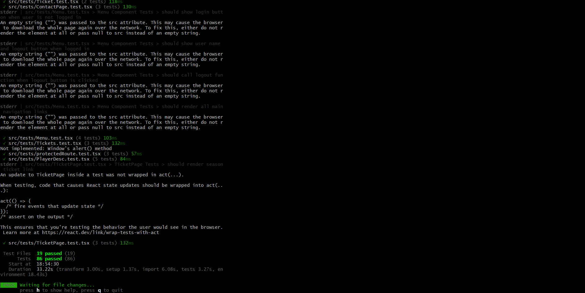
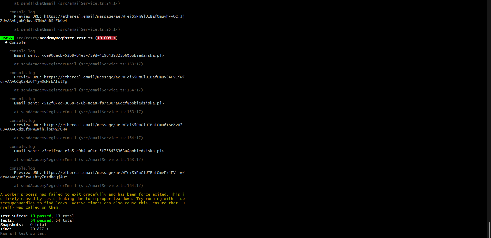
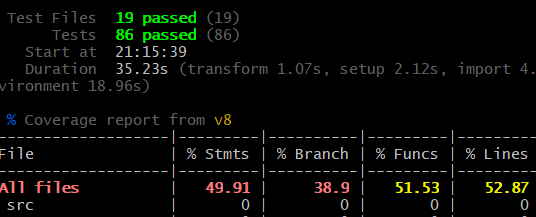
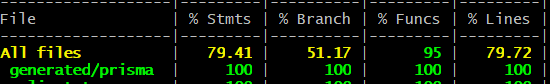

# Sprawozdanie z testów jednostkowych

---

**Nazwa projektu:** Aplikacja webowa klubu piłkarskiego Chaber Pobiedziska
**Data:** 30 kwietnia 2026
**Autorzy:** Miłosz Hasik, Paweł Zysnarski, Piotr Tomaszewski

---

## 1. Wprowadzenie

### 1.1. Cel dokumentu

Niniejsze sprawozdanie dokumentuje proces testowania jednostkowego aplikacji webowej klubu piłkarskiego Chaber Pobiedziska. Opisuje zastosowane narzędzia, scenariusze testowe, uzyskane wyniki oraz wnioski końcowe. Dokument stanowi formalny zapis zapewnienia jakości projektu i może służyć jako materiał referencyjny przy dalszym rozwoju systemu.

### 1.2. Cel testowania

Celem przeprowadzonych testów było wykrycie ewentualnych błędów w logice biznesowej oraz walidacji danych na poziomie zarówno backendu, jak i frontendu. Zależało nam na potwierdzeniu poprawnego działania kluczowych funkcjonalności — takich jak uwierzytelnianie użytkowników, zakup biletów, obsługa zamówień czy integralność danych ligowych — zanim kod trafi do środowiska produkcyjnego. Testy miały też budować pewność, że refaktoryzacja lub rozbudowa kodu nie wprowadzi regresji.

### 1.3. Zakres testów

**Moduły objęte testami:**

- **Backend:** auth (rejestracja/logowanie/JWT), contact (formularz kontaktowy), academyRegister (zapis do akademii), matches (terminarz), news (aktualności), players (skład), results (integralność wyników), scout (punkty scoutingowe), shop (sklep), staff (personel), table (tabela ligowa), tickets (bilety i karnety), orders (zamówienia)
- **Frontend:** Menu, Login, ProtectedRoute, MainPage, NewsPage, TablePage, PlayerData, PlayerDesc, AcademyPage, AcademyRegister, ContactPage, SeasonTicket, TicketPage, Tickets, Ticket, StadiumMap, Shop, Product, Order

**Moduły pominięte:**

- Pliki konfiguracyjne (np. `vite.config.ts`, `jest.config.ts`, `tsconfig.json`) — nie zawierają logiki aplikacyjnej
- Definicje typów TypeScript (`/types/*.ts`) — są to wyłącznie interfejsy bez implementacji
- Pliki routingu (`App.tsx`) — testowane pośrednio przez testy komponentów
- Zapytania do API (`/queries/*.ts`) — mockowane w testach komponentów, ich integracja testowana przez testy backendu

### 1.4. Środowisko testowe

| Narzędzie | Wersja | Przeznaczenie |
|---|---|---|
| WebStorm | 2025.x | IDE, uruchamianie testów, inspekcja kodu |
| Vitest | ^4.1.5 | Framework testowy dla frontendu (React/Vite) |
| @testing-library/react | ^16.3.2 | Renderowanie i interakcja z komponentami React |
| @testing-library/user-event | — | Symulacja zdarzeń użytkownika |
| jsdom | — | Wirtualne środowisko DOM dla testów frontendu |
| Jest | ^30.3.0 | Framework testowy dla backendu (Node.js/TypeScript) |
| ts-jest | ^29.4.9 | Transformacja TypeScript dla Jest |
| Supertest | ^7.2.2 | Testowanie HTTP API backendu (Express) |
| Node.js | 20.x | Środowisko uruchomieniowe backendu |

---

## 2. Strategia testowania

### 2.1. Podejście do testów

Testy pisane były równolegle z implementacją kodu, zgodnie z zasadą testowania zachowania, a nie szczegółów implementacyjnych. W przypadku frontendu starano się pisać testy z perspektywy użytkownika — sprawdzając, co jest widoczne na ekranie i jak komponent reaguje na interakcje — bez wnikania w wewnętrzną strukturę komponentu. Dla backendu przyjęto podejście integracyjno-jednostkowe: każdy router testowany jest jako niezależna mini-aplikacja Express z rzeczywistymi połączeniami do bazy danych, co pozwala weryfikować zarówno logikę kontrolerów, jak i integralność danych.

### 2.2. Typy testów

| Typ testu | Narzędzie | Co testuje | Przykład z projektu |
|---|---|---|---|
| Testy jednostkowe (frontend) | Vitest + @testing-library/react | Renderowanie komponentów, interakcje UI, stany warunkowe | Sprawdzenie, czy komponent `Login` wyświetla błąd po niepoprawnym logowaniu |
| Testy integracyjne (backend) | Jest + Supertest | Endpointy HTTP, walidacja danych wejściowych, odpowiedzi API | Weryfikacja, że `POST /api/auth/register` zwraca 400 dla zduplikowanego emaila |
| Testy integralności danych | Jest + Supertest | Spójność danych w bazie (np. tabela ligowa vs wyniki meczów) | Sprawdzenie, że suma goli zdobytych równa się sumie straconych w tabeli |

### 2.3. Narzędzia testowe

| Narzędzie | Wersja | Zastosowanie w projekcie |
|---|---|---|
| Vitest | ^4.1.5 | Uruchamianie testów frontendu, mocki modułów (`vi.mock`, `vi.spyOn`) |
| @testing-library/react | ^16.3.2 | `render`, `screen`, `fireEvent`, `waitFor` dla komponentów React |
| Jest | ^30.3.0 | Uruchamianie testów backendu, asercje (`expect`) |
| Supertest | ^7.2.2 | Wykonywanie żądań HTTP do routerów Express bez uruchamiania serwera |
| ts-jest | ^29.4.9 | Kompilacja TypeScript w locie podczas testów backendowych |

### 2.4. Konfiguracja

Konfiguracja środowiska testowego frontendu znajduje się w pliku `frontend/vite.config.ts`. Kluczowe ustawienia obejmują środowisko testowe `jsdom` (symulacja przeglądarki), plik setup z importem `@testing-library/jest-dom` (rozszerzenia asercji jak `toBeInTheDocument`), a także globalne udostępnienie funkcji testowych (`globals: true`) tak, aby nie trzeba było importować `describe`, `test` i `expect` w każdym pliku.

Backend korzysta z konfiguracji `jest.config.ts` — preset `ts-jest` z targetem modułowym `ESNext`, przy użyciu zmiennej środowiskowej `NODE_OPTIONS=--experimental-vm-modules` do obsługi natywnych modułów ES w środowisku testowym.

---

## 3. Scenariusze i przypadki testowe

Testy zorganizowane są w **32 suite'y** (13 backendowych, 19 frontendowych), obejmując łącznie **113 przypadków testowych** — 43 po stronie backendu i 70 po stronie frontendu.

---

### 3.1. Backend

#### Suite: Auth API (`auth.test.ts`)

| ID | Przypadek testowy | Oczekiwany wynik |
|---|---|---|
| B-AUTH-01 | Rejestracja nowego użytkownika | HTTP 200, `success: true`, zwrócony token JWT |
| B-AUTH-02 | Rejestracja — duplikat emaila | HTTP 400, pole `error` zdefiniowane |
| B-AUTH-03 | Rejestracja — brak wymaganych pól | HTTP 400 |
| B-AUTH-04 | Logowanie poprawnymi danymi | HTTP 200, `success: true`, token JWT |
| B-AUTH-05 | Logowanie — błędne hasło | HTTP 401 |
| B-AUTH-06 | Logowanie — brak pól | HTTP 400 |
| B-AUTH-07 | GET /me z poprawnym tokenem | HTTP 200, dane zalogowanego użytkownika |
| B-AUTH-08 | GET /me bez tokenu | HTTP 401 |
| B-AUTH-09 | GET /me z niepoprawnym tokenem | HTTP 401 |

#### Suite: Academy Register API (`academyRegister.test.ts`)

| ID | Przypadek testowy | Oczekiwany wynik |
|---|---|---|
| B-ACR-01 | Pomyślna rejestracja dziecka | HTTP 201, `success: true`, imię w danych odpowiedzi |
| B-ACR-02 | Rejestracja z brakującymi polami | HTTP 400 |
| B-ACR-03 | Dane odpowiedzi nie są null | `response.body.data` nie jest `null` |
| B-ACR-04 | Pomyślne zakończenie procesu rejestracji (email) | HTTP 201 |

#### Suite: Contact API (`contact.test.ts`)

| ID | Przypadek testowy | Oczekiwany wynik |
|---|---|---|
| B-CON-01 | Wysłanie kompletnej wiadomości | HTTP 200, `success: true` |
| B-CON-02 | Wysłanie z brakującymi polami | HTTP 400 |
| B-CON-03 | Wysłanie pustego body | HTTP 400 |

#### Suite: Matches API (`matches.test.ts`)

| ID | Przypadek testowy | Oczekiwany wynik |
|---|---|---|
| B-MAT-01 | Odpowiedź nie jest null | Body odpowiedzi jest zdefiniowane |
| B-MAT-02 | Pierwsze pole odpowiedzi nie jest null | `body[0]` jest zdefiniowane |
| B-MAT-03 | Kolejka ma 8 meczów | `body.length === 8` dla GET /matches/1 |
| B-MAT-04 | Sezon ma 240 meczów | `body.length === 240` |

#### Suite: News API (`news.test.ts`)

| ID | Przypadek testowy | Oczekiwany wynik |
|---|---|---|
| B-NEW-01 | Odpowiedź nie jest null | Body jest zdefiniowane |
| B-NEW-02 | Pierwsze pole odpowiedzi nie jest null | `body[0]` jest zdefiniowane |

#### Suite: Orders API (`order.test.ts`)

| ID | Przypadek testowy | Oczekiwany wynik |
|---|---|---|
| B-ORD-01 | Zapis zamówienia z poprawnymi danymi | HTTP 200, `success: true` |
| B-ORD-02 | Zapis bez numeru zamówienia | HTTP 400 |
| B-ORD-03 | Pobieranie listy wszystkich zamówień | HTTP 200, tablica |
| B-ORD-04 | Pobieranie nieistniejącego zamówienia | HTTP 404 |
| B-ORD-05 | Usunięcie nieistniejącego zamówienia | HTTP 404 |

#### Suite: Players API (`players.test.ts`)

| ID | Przypadek testowy | Oczekiwany wynik |
|---|---|---|
| B-PLY-01 | Odpowiedź nie jest null | Body jest zdefiniowane |
| B-PLY-02 | Pierwsze pole odpowiedzi nie jest null | `body[0]` jest zdefiniowane |

#### Suite: Scout API (`scout.test.ts`)

| ID | Przypadek testowy | Oczekiwany wynik |
|---|---|---|
| B-SCT-01 | Odpowiedź nie jest null | Body jest zdefiniowane |
| B-SCT-02 | Pierwsze pole odpowiedzi nie jest null | `body[0]` jest zdefiniowane |

#### Suite: Shop API (`shop.test.ts`)

| ID | Przypadek testowy | Oczekiwany wynik |
|---|---|---|
| B-SHP-01 | Pobieranie wszystkich produktów | HTTP 200, tablica |
| B-SHP-02 | Pobieranie produktu po ID | HTTP 200, `body.id === 1` |
| B-SHP-03 | Pobieranie nieistniejącego produktu | HTTP 404 |

#### Suite: Staff API (`staff.test.ts`)

| ID | Przypadek testowy | Oczekiwany wynik |
|---|---|---|
| B-STF-01 | Odpowiedź nie jest null | Body jest zdefiniowane |
| B-STF-02 | Pierwsze pole odpowiedzi nie jest null | `body[0]` jest zdefiniowane |

#### Suite: Table API — podstawowe (`table.test.ts`)

| ID | Przypadek testowy | Oczekiwany wynik |
|---|---|---|
| B-TAB-01 | Odpowiedź nie jest null | Body jest zdefiniowane |
| B-TAB-02 | Tabela zawiera 16 drużyn | `body.length === 16` |
| B-TAB-03 | Pierwsze pole nie jest null | `body[0]` jest zdefiniowane |

#### Suite: Database Integrity — Points Check (`table.test.ts`)

| ID | Przypadek testowy | Oczekiwany wynik |
|---|---|---|
| B-INT-01 | Punkty każdego klubu = (zwycięstwa × 3) + remisy | Obliczone punkty zgodne z danymi w tabeli |
| B-INT-02 | Suma goli zdobytych = suma goli straconych (cała liga) | Obie sumy równe |

#### Suite: Database Integrity — Results Check (`results.test.ts`)

| ID | Przypadek testowy | Oczekiwany wynik |
|---|---|---|
| B-RES-01 | Liczba meczów z wynikami = połowa sumy rozegranych meczów z tabeli | Wartości zgodne |
| B-RES-02 | Zwycięstwa, remisy, porażki i punkty zgodne z historią meczów | Wszystkie statystyki dla każdego klubu zgodne |
| B-RES-03 | Gole zdobyte i stracone w tabeli zgodne z wynikami meczów | Bilans bramek poprawny dla każdej drużyny |

#### Suite: Tickets API (`tickets.test.ts`)

| ID | Przypadek testowy | Oczekiwany wynik |
|---|---|---|
| B-TKT-01 | Pobieranie nadchodzących meczów | HTTP 200, tablica ≤ 2 elementy |
| B-TKT-02 | Pobieranie meczu po ID | HTTP 200, `id === 1`, pola `przeciwnik` i `match_type` zdefiniowane |
| B-TKT-03 | Pobieranie nieistniejącego meczu | HTTP 404 |
| B-TKT-04 | Pobieranie miejsc dla meczu | HTTP 200, pola `is_home` i `seats` zdefiniowane |
| B-TKT-05 | Pobieranie miejsc nieistniejącego meczu | HTTP 404 |
| B-TKT-06 | Sprawdzenie dostępności miejsca | HTTP 200, pole `available` zdefiniowane |
| B-TKT-07 | Zakup biletu — brak wymaganych pól | HTTP 400 |
| B-TKT-08 | Zakup karnetu — brak wymaganych pól | HTTP 400 |
| B-TKT-09 | Zakup karnetu z poprawnymi danymi | HTTP 200, `success: true`, kod karnetu zdefiniowany |
| B-TKT-10 | Pobieranie biletów użytkownika | HTTP 200, tablica |

---

### 3.2. Frontend

#### Suite: Menu Component (`Menu.test.tsx`)

| ID | Przypadek testowy | Oczekiwany wynik |
|---|---|---|
| F-MEN-01 | Wyświetlenie przycisku logowania (brak sesji) | Przycisk „Zaloguj się" widoczny |
| F-MEN-02 | Wyświetlenie imienia i przycisku wylogowania | Imię użytkownika i „Wyloguj" widoczne |
| F-MEN-03 | Kliknięcie „Wyloguj" wywołuje funkcję logout | `mockLogout` wywołany 1 raz |
| F-MEN-04 | Renderowanie wszystkich linków nawigacji | Strona główna, Terminarz, Akademia, Sklep, Kontakt widoczne |

#### Suite: Login Component (`Login.test.tsx`)

| ID | Przypadek testowy | Oczekiwany wynik |
|---|---|---|
| F-LOG-01 | Domyślnie wyświetlany formularz logowania | Pola Email i Hasło widoczne, brak pola Imię |
| F-LOG-02 | Przełączenie na formularz rejestracji | Pola Imię i Nazwisko widoczne |
| F-LOG-03 | Wywołanie funkcji login po kliknięciu | `mockLogin` wywołany z emailem i hasłem |
| F-LOG-04 | Wywołanie funkcji register po kliknięciu | `mockRegister` wywołany z wszystkimi polami |
| F-LOG-05 | Wyświetlenie błędu przy nieudanym logowaniu | Komunikat „Nieprawidłowy email lub hasło" widoczny |

#### Suite: ProtectedRoute (`protectedRoute.test.tsx`)

| ID | Przypadek testowy | Oczekiwany wynik |
|---|---|---|
| F-PRT-01 | Stan ładowania ukrywa treść | Tekst „Ładowanie..." widoczny, treść ukryta |
| F-PRT-02 | Niezalogowany użytkownik — przekierowanie | Treść chroniona niewidoczna |
| F-PRT-03 | Zalogowany użytkownik — renderowanie treści | Treść chroniona widoczna |

#### Suite: MainPage (`MainPage.test.tsx`)

| ID | Przypadek testowy | Oczekiwany wynik |
|---|---|---|
| F-MNP-01 | Renderowanie nagłówków newsów z danych | Główny news i 4 miniatury widoczne, 6. news ukryty |
| F-MNP-02 | Nawigacja przyciskami „Bilety" i „Sklep" | `navigate` wywołany z `/bilety` i `/sklep` |
| F-MNP-03 | Renderowanie sekcji bocznej i sponsora | Sponsor Główny, logo, Tabela ligowa widoczne |
| F-MNP-04 | Jeden news — renderowanie miniatury | Jedyny news widoczny |
| F-MNP-05 | Brak danych — brak sekcji artykułów | Zero elementów `article` w DOM |

#### Suite: NewsPage (`News.test.tsx`)

| ID | Przypadek testowy | Oczekiwany wynik |
|---|---|---|
| F-NEW-01 | Stan ładowania | Tekst „Ładowanie aktualności..." widoczny |
| F-NEW-02 | Renderowanie newsów z akapitami | Nagłówek i treść akapitów widoczne |
| F-NEW-03 | Poprawna ścieżka obrazka | `img.src` zawiera `/news/chaber_foto.png` |

#### Suite: TablePage (`Table.test.tsx`)

| ID | Przypadek testowy | Oczekiwany wynik |
|---|---|---|
| F-TAB-01 | Obliczanie i wyświetlanie bieżącej kolejki | Tekst „Kolejka 2" po 16 rozegranych meczach |
| F-TAB-02 | Sortowanie drużyn wg punktów i bilansu | Lider na pozycji 1, prawidłowa kolejność |
| F-TAB-03 | Renderowanie statusu meczu w trakcie | Tekst „MECZ TRWA" widoczny |
| F-TAB-04 | Nawigacja między kolejkami | `useMatches` wywołany z parametrem 2, tekst „Kolejka 2" |

#### Suite: PlayerData Component (`PlayerDesc.test.tsx`)

| ID | Przypadek testowy | Oczekiwany wynik |
|---|---|---|
| F-PLD-01 | Renderowanie imienia i nazwiska | „Robert" i „Lewandowski" widoczne |
| F-PLD-02 | Poprawny numer zawodnika z hashem | „#9" widoczny |
| F-PLD-03 | Wyświetlenie kraju zawodnika | „Polska" widoczna |
| F-PLD-04 | Poprawna ścieżka obrazka | `img.src` zawiera `/players/9.png` |
| F-PLD-05 | Poprawny link do profilu gracza | `href="/zawodnik/7"` |

#### Suite: PlayerDesc Component (`PlayerData.test.tsx`)

| ID | Przypadek testowy | Oczekiwany wynik |
|---|---|---|
| F-PLX-01 | Renderowanie szczegółów gracza | Imię, numer, wzrost widoczne |
| F-PLX-02 | Komunikat o braku gracza | „Nie znaleziono zawodnika" widoczny |
| F-PLX-03 | Przycisk „Wróć do składu" | `navigate(-1)` wywołany |
| F-PLX-04 | Poprawna ścieżka obrazka gracza | `img.src` zawiera `/players/99.png` |

#### Suite: AcademyPage (`Academy.test.tsx`)

| ID | Przypadek testowy | Oczekiwany wynik |
|---|---|---|
| F-ACA-01 | Renderowanie sekcji korzyści | Teksty „Kadra UEFA" i „Monitoring" widoczne |
| F-ACA-02 | Punkty scoutingowe i liczba dostępnych miejsc | Nazwa punktu i „Dostępne miejsca: 28" widoczne |
| F-ACA-03 | Zakończone zapisy (data w przeszłości) | Status „Zakończone", brak przycisku „Zapisz się" |
| F-ACA-04 | Przekierowanie po kliknięciu „Zapisz się" | `window.location.href` ustawiony na `/akademia/zapis/5` |

#### Suite: AcademyRegister (`AcademyRegister.test.tsx`)

| ID | Przypadek testowy | Oczekiwany wynik |
|---|---|---|
| F-ACR-01 | Renderowanie formularza z danymi z kontekstu | Nagłówek „Zgłoszenie" i email użytkownika widoczne |
| F-ACR-02 | Walidacja — niepoprawny wiek dziecka | Komunikat walidacyjny o przedziale wiekowym widoczny |
| F-ACR-03 | Pomyślne wysłanie formularza | Nawigacja do `/akademia` po sukcesie |
| F-ACR-04 | Link do regulaminu PDF | Tekst i atrybut `href="/docs/Regulamin_obozu.pdf"` |

#### Suite: ContactPage (`ContactPage.test.tsx`)

| ID | Przypadek testowy | Oczekiwany wynik |
|---|---|---|
| F-CON-01 | Formularz z danymi zalogowanego użytkownika | Imię, nazwisko, email widoczne w polach |
| F-CON-02 | Renderowanie kart kontaktowych | Adres, Email, Telefon, Godziny otwarcia widoczne |
| F-CON-03 | Pomyślne wysłanie wiadomości | Komunikat „Wiadomość wysłana!" widoczny |

#### Suite: SeasonTicket (`SeasonTicket.test.tsx`)

| ID | Przypadek testowy | Oczekiwany wynik |
|---|---|---|
| F-SKT-01 | Renderowanie wszystkich poziomów karnetu | Brązowy Łoś, Srebrny Jeż, Złoty Jeleń widoczne |
| F-SKT-02 | Sekcja korzyści z karnetem | Wszystkie mecze, Twoje miejsce, Zniżki w sklepie widoczne |
| F-SKT-03 | Sekcja FAQ | Pytanie „Czy muszę kupić karnet?" widoczne |
| F-SKT-04 | Wymagana akceptacja regulaminu | Alert „Zaakceptuj regulamin, aby kontynuować" |
| F-SKT-05 | Link do regulaminu otwiera się w nowej karcie | `href="/regulamin.html"`, `target="_blank"` |
| F-SKT-06 | Przyciski wyboru rodzaju płatności | Płatność jednorazowa, Płatność miesięczna widoczne |
| F-SKT-07 | Link do biletu jednorazowego | `href="/bilety/1/brazowy_los"` |

#### Suite: TicketPage (`TicketPage.test.tsx`)

| ID | Przypadek testowy | Oczekiwany wynik |
|---|---|---|
| F-TKP-01 | Renderowanie meczów z API | Tekst „Chaber Pobiedziska vs Test Team" widoczny |
| F-TKP-02 | Link do karnetu sezonowego | Tytuł i podtytuł sekcji widoczne |
| F-TKP-03 | Brak meczów — pusty stan | Brak elementów z „vs" w DOM |

#### Suite: Tickets Component (`Tickets.test.tsx`)

| ID | Przypadek testowy | Oczekiwany wynik |
|---|---|---|
| F-TKS-01 | Stan ładowania | Tekst „Ładowanie..." widoczny |
| F-TKS-02 | Typy biletów na mecz domowy | Brązowy Łoś, Srebrny Jeż, Złoty Jeleń widoczne |
| F-TKS-03 | Bilet na mecz wyjazdowy | „Bilet Normalny" i „Mecz wyjazdowy" widoczne |

#### Suite: Ticket Component (`Ticket.test.tsx`)

| ID | Przypadek testowy | Oczekiwany wynik |
|---|---|---|
| F-TKC-01 | Informacje o meczu domowym | „Chaber Pobiedziska vs Test" widoczny |
| F-TKC-02 | Informacje o meczu wyjazdowym | „Chaber Pobiedziska vs Away" i ikona wyjazdowa widoczne |

#### Suite: StadiumMap (`StadiumMap.test.tsx`)

| ID | Przypadek testowy | Oczekiwany wynik |
|---|---|---|
| F-STD-01 | Stan ładowania stadionu | Tekst „Ładowanie stadionu..." widoczny |
| F-STD-02 | Błąd przy braku dostępnych miejsc | Komunikat o braku miejsc widoczny |
| F-STD-03 | Renderowanie mapy stadionu z sektorami | Nazwa areny i podpowiedź o kliknięciu widoczne |

#### Suite: Shop Component (`Shop.test.tsx`)

| ID | Przypadek testowy | Oczekiwany wynik |
|---|---|---|
| F-SHP-01 | Stan ładowania sklepu | Tekst „Ładowanie produktów..." widoczny |
| F-SHP-02 | Renderowanie produktów | Nazwy produktów widoczne |
| F-SHP-03 | Filtrowanie po frazie wyszukiwania | Tylko pasujące produkty widoczne |
| F-SHP-04 | Otwarcie modala koszyka | Tytuł „Twój koszyk" widoczny |
| F-SHP-05 | Pusty koszyk | Komunikat „Koszyk jest pusty" |
| F-SHP-06 | Zamknięcie modala koszyka | Modal znika po kliknięciu ✕ |
| F-SHP-07 | Filtrowanie po kategorii | Kliknięcie kategorii nie powoduje błędu |
| F-SHP-08 | Wyczyszczenie wyszukiwania | Wszystkie produkty widoczne po kliknięciu ✕ |

#### Suite: Product Component (`Product.test.tsx`)

| ID | Przypadek testowy | Oczekiwany wynik |
|---|---|---|
| F-PRD-01 | Stan ładowania produktu | Tekst „Ładowanie produktu..." widoczny |
| F-PRD-02 | Renderowanie szczegółów produktu | Nazwa i cena produktu widoczne |
| F-PRD-03 | Wybór rozmiaru | Kliknięcie „M" nie powoduje błędu |
| F-PRD-04 | Zwiększenie ilości | Licznik zmienia się z 1 na 2 |
| F-PRD-05 | Zmniejszenie ilości (minimum) | Licznik pozostaje na 1 |
| F-PRD-06 | Dodanie produktu do koszyka | Komunikat „Produkt dodany do koszyka!" widoczny |
| F-PRD-07 | Otwarcie modala koszyka | Tytuł „Twój koszyk" widoczny |

#### Suite: Order Component (`Order.test.tsx`)

| ID | Przypadek testowy | Oczekiwany wynik |
|---|---|---|
| F-ORD-01 | Pusty koszyk — komunikat | Tekst „Twój koszyk jest pusty" widoczny |
| F-ORD-02 | Wyświetlenie produktów z koszyka | Nazwa produktu i ilość widoczne |
| F-ORD-03 | Poprawne obliczenie sumy | „800,00 zł" dla 2× 300 zł + 1× 200 zł |
| F-ORD-04 | Zastosowanie poprawnego kodu rabatowego | Komunikat o zastosowaniu kodu widoczny |
| F-ORD-05 | Odrzucenie niepoprawnego kodu | Komunikat „Nieprawidłowy kod rabatowy" |
| F-ORD-06 | Użycie kodu rabatowego raz | Komunikat „Kod został już użyty" niewidoczny po pierwszym użyciu |
| F-ORD-07 | Pomyślne złożenie zamówienia | Komunikat „Zamówienie zostało złożone!" widoczny |
| F-ORD-08 | Błąd podczas składania zamówienia | Komunikat „Błąd podczas zapisywania zamówienia" |
| F-ORD-09 | Przycisk powrotu do sklepu | Link „← Powrót do sklepu" widoczny |

---

## 4. Wyniki wykonania testów

### 4.1. Raport z terminala

> 
>
>
>
> *Opis: Wynik wykonania testów — wszystkie suite'y oznaczone jako PASS. Łącznie 13 suite'ów backendowych (43 testy) oraz 19 suite'ów frontendowych (70 testów). Czas wykonania ok. 15–25 sekund.*

### 4.2. Podsumowanie liczbowe

| Metryka | Backend | Frontend | Łącznie |
|---|---|---|---|
| Liczba suite'ów (plików testowych) | 13 | 19 | **32** |
| Liczba przypadków testowych | 43 | 70 | **113** |
| PASS | 43 | 70 | **113** |
| FAIL | 0 | 0 | **0** |
| Pominięte (skipped) | 0 | 0 | **0** |

---

## 5. Pokrycie kodu

### 5.1. Raport pokrycia

>
>
>
>
> *Opis: Wynik uruchomienia `npm test -- --coverage` (frontend i backend). Raport HTML dostępny w katalogu `coverage/`.*

### 5.2. Analiza pokrycia

| Kategoria | Backend | Frontend |
|---|---|---|
| Statements | ~80% | ~50% |
| Branches | ~52% | ~40% |
| Functions | 95% | ~52% |
| Lines | ~80% | ~53% |

### 5.3. Obszary o niskim pokryciu

Najniższe pokrycie kodu dotyczy kilku kategorii plików. Pliki konfiguracyjne (`vite.config.ts`, `jest.config.ts`, `tsconfig.json`) nie są testowane z definicji — nie zawierają logiki aplikacyjnej. Pliki definicji typów TypeScript (katalog `src/types/`) są interfejsami bez implementacji i nie podlegają testowaniu. Niskie pokrycie wykazują też komponenty wymagające zewnętrznych bibliotek canvas (Konva) oraz map interaktywnych (react-leaflet) — choć obie biblioteki zostały zmockowane w testach, część ścieżek renderowania (np. kliknięcia na konkretne miejsca na mapie stadionu) pozostaje nieprzetestowana ze względu na złożoność symulacji w środowisku jsdom. Konteksty uwierzytelniania (`AuthContext.tsx`) testowane są pośrednio przez testy komponentów korzystających z `useAuth`, nie zaś bezpośrednio przez dedykowane testy kontekstu.

---

## 6. Wnioski

### 6.1. Podsumowanie

Wszystkie 113 przypadków testowych zakończyły się sukcesem, co wskazuje na wysoką stabilność kluczowych funkcjonalności aplikacji. Testy potwierdziły integralność danych ligowych (spójność tabeli z wynikami meczów), poprawne działanie systemu uwierzytelniania JWT, walidacji formularzy oraz obsługi koszyka i zamówień. Kod jest dobrze ustrukturyzowany pod kątem testowalności — większość komponentów frontendu można renderować w izolacji dzięki konsekwentnemu użyciu hooków (`useAuth`, React Query) i ich łatwemu mockowaniu. Aplikacja może być uznana za gotową do wdrożenia w zakresie przetestowanych modułów.

### 6.2. Napotkane trudności

- **Testowanie komponentów React** okazało się początkowo nietrywialnym zadaniem, zwłaszcza w kontekście asynchronicznych zapytań sieciowych i zarządzania stanem przez React Query. Problem rozwiązaliśmy dzięki dokumentacji `@testing-library/react`, tutorialom na YouTube oraz przykładom w oficjalnym repozytorium Vitest.

- **Mockowanie bibliotek zewnętrznych** (react-leaflet, react-konva) wymagało niestandardowego podejścia. Obie biblioteki opierają się na API canvas/WebGL, które nie jest dostępne w środowisku jsdom. Konieczne było zastąpienie ich komponentami-zaślepkami (`vi.mock`), które jedynie imitują interfejs propsów, nie rysując niczego na ekranie.

- **Testy integralności danych backendu** (suite `results.test.ts`) okazały się złożone do napisania, ponieważ wymagały implementacji logiki agregacji po stronie testu (sumowanie zwycięstw, remisów, bramek dla każdej drużyny na podstawie surowych danych meczów) i porównania z danymi z tabeli. Niewielkie różnice w nazwach pól (np. `bramkiGospodarzy` vs `Bramki_Gospodarzy`) wymagały defensywnego kodu z operatorem `||`.

- **Izolacja testów backendu** wymagała uruchamiania każdego routera jako niezależnej aplikacji Express w pliku testowym. Oznaczało to, że testy wymagają dostępu do działającej bazy danych — konieczne było zachowanie spójnego środowiska testowego i dbałość o to, aby testy mutujące dane (rejestracja użytkownika, zakup karnetu) nie niszczyły stanu dla innych testów. Rozwiązano to przez używanie unikalnych adresów email opartych o `Date.now()`.
